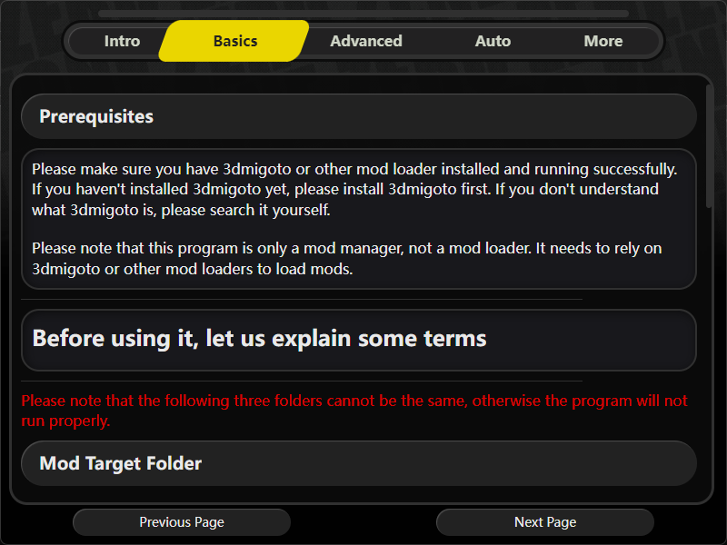
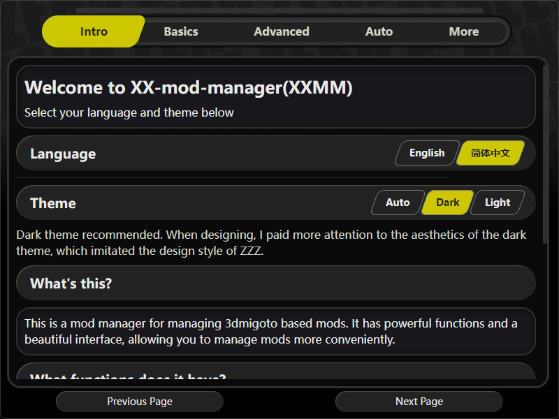
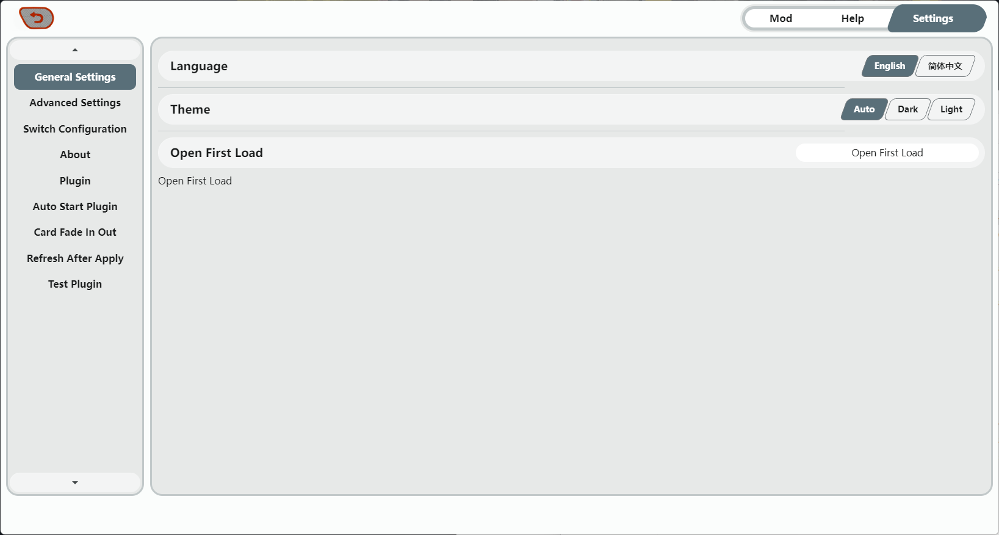

readme: [简体中文](readme.md) | English

<h1 align="center">XX Mod Manager</h1>
<h4 align="center">A mod manager for managing all 3dmigoto-based mods</h4>

  <a href="#features">Features</a> •
  <a href="#installation">Installation</a> •
  <a href="#quick-introduction">Quick Introduction</a> •
  <a href="#support-for-mod-loaders">Support for Mod Loaders</a> •
  <a href="#license">License</a> •
  <a href="#support-development">Support Development</a> •
  <a href="#future-plans">Future Plans</a>

  
  
  

## Disclaimer

- **Development Warning**: XXMI Launcher is still in development and may contain bugs, crashes, or other issues. Please report them to the [issues](https://github.com/XiaoLinXiaoZhu/XX-Mod-Manager/issues) page.

## Features

- **ZZZ Style Design**: Designed and laid out in the style of ZZZ, making the overall style more unified.
- **Easy Management**: Easily view and manage your mods using mod cards, with support for filtering mods by character.
- **Convenient Import**: Import mods by dragging and dropping folders or archives.
- **Edit Mod Information**: Set mod covers by dragging images from local or web sources; open the mod information edit page to edit mod details such as character, hotkeys, description, source link, etc.
- **Automation**: Supports automatically opening the game and mod loader when the program starts, and automatically refreshing mods in-game after clicking the apply button.
- **Plugin Support**: Supports plugin extensions, allowing you to achieve more functionality through plugins.

## Installation

XX-Mod-Manager is just a mod manager and does not include a mod loader. You can choose a mod loader according to your preference. I will introduce how to combine various mod loaders with XX-Mod-Manager later.

### For Windows Users
1. Download the latest version of the **XX-Mod-Manager-X.X.X-win.zip** file.
2. Extract the **XX-Mod-Manager-X.X.X-win.zip** file.
3. Run the **XX-Mod-Manager.exe** program.

tips: Please do not download the **XX-Mod-Manager-Setup-X.X.X.exe** file, as it is an installer that I have not tested and may have various issues.

### For Linux Users
1. Download the latest version of the **xx-mods-manager-X.X.X.tar.xz** file.
2. Extract the **xx-mods-manager-X.X.X.tar.xz** file.
3. Run the **xx-mods-manager** program.

tips: I have not tested the program on Linux. The **automatically open game and mod loader** and **refresh mods in-game** features use Windows APIs and some Windows-specific features, so they may not work properly on Linux. However, the other features should work fine.

## Quick Introduction

### Terminology

Many people often find it unclear how to use this program, even though I believe I have explained it clearly in the beginner's guide and help page. However, I will briefly introduce it here.

First, you need to understand how this program manages mods:
It creates virtual links from the mods stored in the **modSource** folder to the **modTarget** folder.
The **mod loader** reads the mods in the **modTarget** folder and loads them into the game.

So, what you need to do is:
1. Store your mods in the **modSource** folder.
2. In the mod management page of the program, **select the mod cards you want to enable** and then **click the apply button**. If everything is normal, you will see some folder shortcuts in the **modTarget** folder.
3. If the mod loader is running properly, you will see the mods take effect in the game when you refresh the mods in-game.

### How to Import Mods

You can import mods by dragging and dropping folders or archives. The program will automatically copy the mods to the **modSource** folder.
Alternatively, you can manually copy the mod folders to the **modSource** folder.

### How to Set Mod Covers

You can set mod covers by dragging images. The program will automatically copy the images to the **modSource** folder. Alternatively, you can click the image upload button in the mod information edit page and select an image to set the mod cover.

### How to Edit Mod Information

You can edit mod information by clicking the edit button in the detailed information bar on the right. You can edit the mod's character, hotkeys, description, source link, etc.
You can also directly enter the edit page by right-clicking the mod card.

When a mod is loaded into the program by dragging and dropping, the program will automatically open the mod information edit page, where you can edit the mod information.

### How to Set Presets

At the bottom of the preset bar on the left, there are preset management and preset add buttons. Click the add button, enter the preset name, and click OK to add a preset.

The program has a default preset that cannot be deleted and will not save any edits.

After creating a mod preset, click the preset name in the preset bar on the left to set the current mod to that preset. Your enable/disable operations for the mod will be saved to that preset.

By clicking the preset management button, you can view all presets and delete presets.

## Support for Mod Loaders

### 3dmigoto Type
These are unwrapped mod loaders that I highly recommend. Their advantages are: they are the most basic, least problematic, responsive, and have no additional features.

You can also find 3dmigoto mod loaders customized for various games, such as:
- [ZZMI - Zenless Zone Zero Model Importer GitHub](https://github.com/leotorrez/ZZ-Model-Importer)
- [SRMI - Honkai: Star Rail Model Importer GitHub](https://github.com/SilentNightSound/SR-Model-Importer)
- [GIMI - Genshin Impact Model Importer GitHub](https://github.com/SilentNightSound/GI-Model-Importer)
- [WWMI - Wuthering Waves Model Importer GitHub](https://github.com/SpectrumQT/WWMI)
- etc.

To use this program with these mod loaders, you only need to set the mod source folder to the Mods folder of the mod loader. If you also want to use the **automatically open game and mod loader** feature, you need to set the mod loader's exe file path to the mod loader path.

### XXMI

XXMI is essentially a wrapped 3dmigoto mod loader with a user interface. Its advantages are: it has a user interface and can switch between multiple games.

To use this program with XXMI, you need to set the mod source folder to the folder specified by XXMI for storing mods. For a more convenient experience, it is recommended to:
1. Set the XXMI **game exe file path** to the path of this program.
2. Enable the **automatically open game and mod loader** feature of this program and set the **game exe file path** to the actual game exe file path.

This way, when you click start game in XXMI, XXMI will start the mod loader and this program, and then this program will start the game. At this point, the XXMI mod loader can load mods normally, and this program can dynamically control the enable/disable of mods and refresh mods in-game.

## Support Development

This program is under development and may encounter various issues during use, but I will release the first official version as soon as possible.

If you are interested, you can

1. Click "Like".

2. Star my GitHub repository.

3. Post your suggestions in the GitHub issue.

4. Join my Discord for more communication: https://discord.gg/HcJaCDHYxH.

5. Join the QQ group for testing (QQ is a communication program running in China): 877012859

If you are capable, you can support me in the following ways:

1. ko-fi: https://ko-fi.com/helloxlxz

# Future Plans

## Main Plans

- [x] Complete the plugin for automatically opening the game and mod loader

---v0.1.0
- [x] Set mod card covers by dragging images
- [x] Fix the bug with dragging images from the web
- [x] Add mods by dragging folders
- [x] Add mods by dragging archives

---v0.2.0
- [x] Automatically refresh mods in-game after applying mods
- [ ] Finish the first-time startup introduction page

---v0.3.0
- [ ] Performance optimization, overall polishing of animations
- [ ] Make pop-up windows in the style of Zenless Zone Zero

---v1.0.0
- [ ] Add a hotkey recognition plugin: automatically add existing hotkey options for newly imported mods by matching keySwap

---v1.1.0
- [ ] Add a mod update plugin: monitor mod updates and notify players when new updates are found

---v1.2.0
- [ ] Add a mod character recognition plugin: try to recognize characters by hash value when importing mods (requires manual import of hash-character table)

---v1.3.0
- [ ] Overall maintenance, bug fixes, animation optimization, code optimization

---v2.0.0
- [ ] Multi-game support: you can switch configurations to control different games with one manager

## Candidate Features

The following features are those that I think may be implemented, but I am not sure if they will be. It depends on community demand and my time.

If you are interested, you can suggest your ideas in the GitHub issue, and I will consider whether to add them to the candidate features.

### Information Editing
- [ ] Read clipboard with ctrl+v to set mod cover (for images that need editing, I recommend editing them and then dragging them into the program instead of copying to the clipboard)

### Plugins
- [ ] Add plugins by dragging js files (actually, you can directly copy plugins to the plugin folder)

## License

XXMM is licensed under the [GPLv3 License](https://github.com/XiaoLinXiaoZhu/XX-Mod-Manager/raw/main/LICENSE).