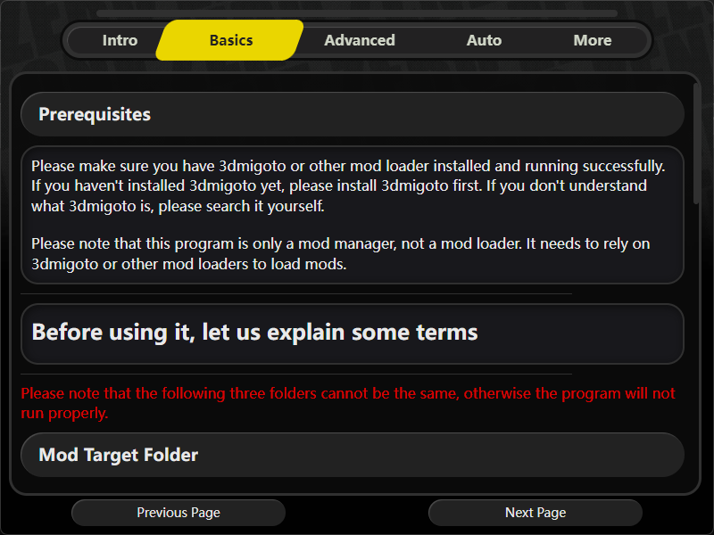
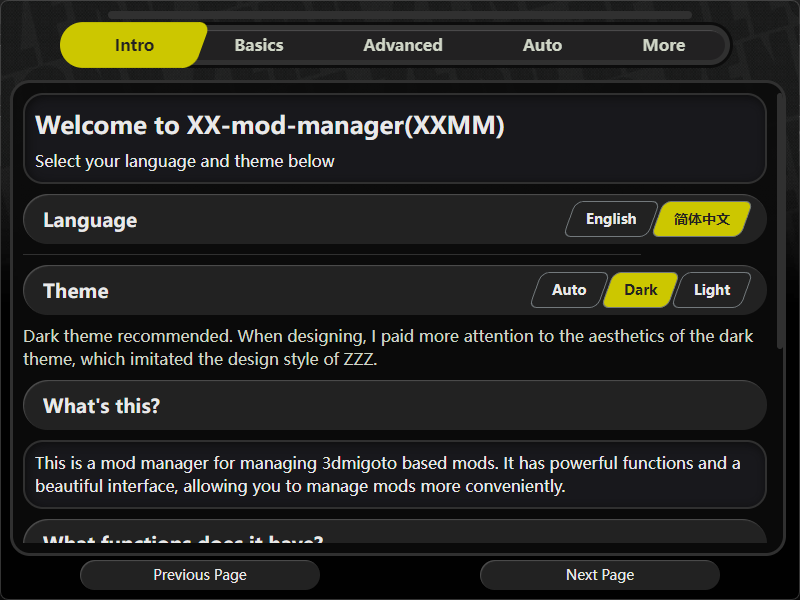
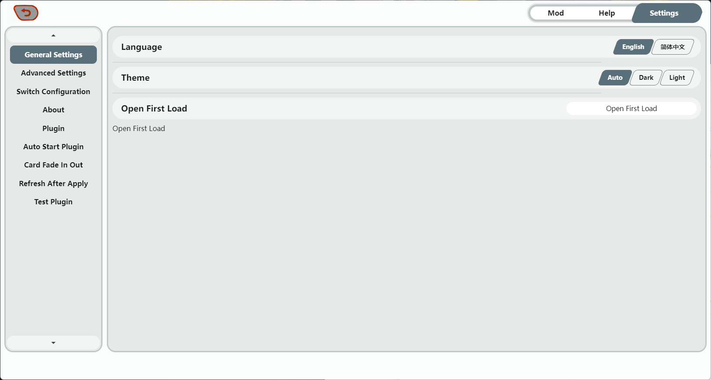

[English](readme-en.md) | 简体中文

<h1 align="center">XX Mod Manager</h1>
<h4 align="center">基于3dmigoto的跨游戏模组管理解决方案</h4>
<p align="center">
  <a href="#特性">特性</a> •
  <a href="#安装">安装</a> •
  <a href="#快速入门">快速入门</a> •
  <a href="#插件生态">插件生态</a> •
  <a href="#支持我们">支持我们</a>
</p>

<div align="center" style="display: flex; flex-wrap: wrap; justify-content: center;">
  
  
  
</div>

## 免责声明
- 🚧 **开发中版本**：当前为测试版本，遇到问题请提交至[问题追踪](https://github.com/XiaoLinXiaoZhu/XX-Mod-Manager/issues)
- 📦 **依赖要求**：需配合3dmigoto或兼容加载器使用（如ZZMI/XXMI）

## 特性

✨ **现代交互体验**
- 仿ZZZ风格的动态界面设计
- 拖拽式模组导入（支持文件夹/ZIP压缩包）
- 可视化模组卡片管理系统
- 智能封面识别（支持网页图片拖拽）

⚡ **高效工作流**
- 一键应用模组配置
- 游戏/加载器自动启动
- 实时模组刷新（支持快捷键绑定）
- 多游戏配置预设系统

🔌 **扩展能力**
- 插件系统支持功能扩展
- 自动化脚本接口
- 跨平台兼容（Windows/Linux）

## 安装

### Windows 用户
1. 下载最新版 [XX-Mod-Manager-X.X.X-win.zip](https://github.com/XiaoLinXiaoZhu/XX-Mod-Manager/releases)
2. 解压后直接运行 `XX-Mod-Manager.exe`

### Linux 用户
```bash
wget https://example.com/xx-mod-manager-X.X.X.tar.xz
tar -xvf xx-mod-manager-X.X.X.tar.xz
./xx-mod-manager
```

## 快速入门

引用`d3dxSkinManage`的一句话：
> 这里似乎少了一些内容，但你知道让开发者找不到某样东西的最好方法是什么吗？把它放在文档里！
> 
> 如果你不习惯 d3dxSkinManage 的操作方式，可以尝试使用其它的管理工具。
> 创新来自那些不满足于现状，总是寻找更好方法的人。


📚 [完整使用指南请访问文档网站](https://xiaolinxiaozhu.github.io/XX-Mod-Manager/)

## 插件生态

通过插件系统实现高级功能扩展：

[查看插件开发文档](https://xiaolinxiaozhu.github.io/XX-Mod-Manager/plugins)

## 支持我们

🤝 **参与开发**：
- 提交Issue反馈问题
- Fork仓库贡献代码
- 翻译多语言支持

☕ **赞助支持**：
- [GitHub Sponsors](https://github.com/sponsors/XiaoLinXiaoZhu)
- [爱发电](https://afdian.com/a/oopstisfic)
- [kofi](https://ko-fi.com/helloxlxz)

📢 **加入社区**：
- QQ群：877012859
- [Discord频道](https://discord.gg/HcJaCDHYxH)

## 许可
GPLv3 Licensed | Copyright © 2024 XiaoLinXiaoZhu 