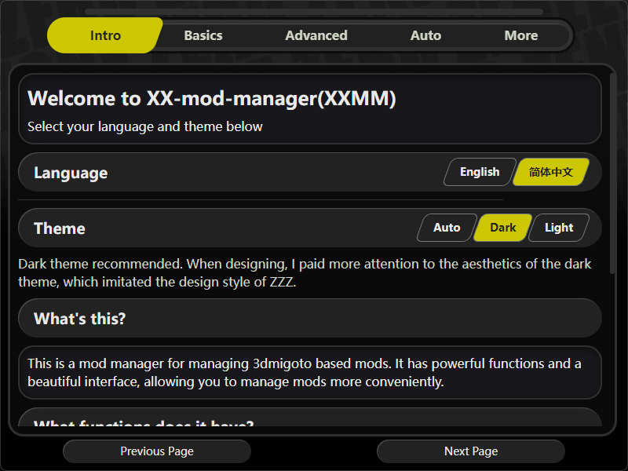

readme: [English](readme-en.md) | 简体中文

<h1 align="center">XX Mod Manager</h1>
<h4 align="center">管理所有 基于3dmigoto的mod 的 mod管理器</h4>

  <a href="#特性">特性</a> •
  <a href="#安装">安装</a> •
  <a href="#简单的介绍">简单的介绍</a> •
  <a href="#对于mod加载器的支持">对于mod加载器的支持</a> •
  <a href="#license">许可</a> •
  <a href="#支持开发">支持开发</a> •
  <a href="#后续计划">后续计划</a>

  
  
    

## 免责声明

- **开发中警告**：XXMI Launcher仍在开发中，可能包含错误、崩溃或其他问题。请将它们报告给[issues](https://github.com/XiaoLinXiaoZhu/XX-Mod-Manager/issues)页面。

## 特性

- **仿ZZZ风格设计**：仿照ZZZ的风格设计，以及布局设计。使得整体风格更加统一。
- **简单的管理**：使用mod卡片轻松查看和管理你的mod，mod支持按照角色进行筛选。
- **便捷的导入**：通过拖拽文件夹或压缩包导入mod。
- **编辑mod信息**：拖拽来自本地或者网页的图片来设置mod封面；打开mod信息编辑页面来编辑mod的：角色、快捷键、描述、来源链接等信息。
- **自动化**：支持启动程序时自动打开游戏和mod加载器，在点击应用按钮后，自动在游戏内刷新mod。
- **插件支持**：支持插件拓展，你可以通过插件实现更多的功能。

## 安装

XX-Mod-Manager 只是一个mod管理器，它并不包含mod加载器。你可以按照自己的喜好选择一个mod加载器。后面我会介绍如何将各种mod加载器和XX-Mod-Manager结合使用。

### 对于windows用户
1. 下载最新版本的 **XX-Mod-Manager-X.X.X-win.zip** 文件。
2. 解压缩 **XX-Mod-Manager-X.X.X-win.zip** 文件。
3. 运行 **XX-Mod-Manager.exe** 程序。

tips: 请不要下载 **XX-Mod-Manager-Setup-X.X.X.exe** 文件，这是一个安装程序，我并没有对其进行测试，它有可能会出现各种各样的问题。

### 对于linux用户
1. 下载最新版本的 **xx-mods-manager-X.X.X.tar.xz** 文件。
2. 解压缩 **xx-mods-manager-X.X.X.tar.xz** 文件。
3. 运行 **xx-mods-manager** 程序。

tips: 我并没有在linux上进行过测试，程序中的 **自动打开游戏和mod加载器**，以及**在游戏内刷新mod** 的功能 使用了 windows 的api 以及部分windows特性，并不确保在linux上能够正常运行。但是其余的功能应该是可以正常使用的。

## 简单的介绍

### 名词解释

经常会有人反应不清楚如何使用这个程序，尽管我认为我在新手教程以及帮助页面中已经写得很清楚了。但是我还是会在这里简单的介绍一下。

首先你需要理清楚这个程序是如何实现mod管理的：
它将你存放在 **modSource（mod来源）** 的 mod 创建虚拟链接 到 **modTarget（mod目标）** 中。
**mod加载器** 会读取 **modTarget（mod目标）** 中的mod，然后加载到游戏中。

所以你需要做的就是：
1. 在 **mod来源文件夹** 中存放你的mod。
2. 在程序的mod管理页面中，**点选你想要启用的mod卡片**，然后**点击应用**按钮，如果一切正常，你能够观察到**mod目标文件夹**中多了一些文件夹的快捷方式。
3. 如果mod加载器被正常运行，那么当你在游戏中刷新mod时，你就能够看到mod生效了。

### 如何导入mod

你可以通过拖拽文件夹或者压缩包来导入mod。程序会自动将mod复制到 **mod来源文件夹** 中。
或者你可以手动将mod文件夹复制到 **mod来源文件夹** 中。

### 如何设置mod封面

你可以通过拖拽图片来设置mod封面。程序会自动将图片复制到 **mod来源文件夹** 中。或者在mod信息编辑页面中，点击图片上传按钮，选择图片来设置mod封面。

### 如何编辑mod信息

你可以通过右侧详细信息栏中的编辑按钮来编辑mod信息。你可以编辑mod的：角色、快捷键、描述、来源链接等信息。
你也可以通过右键点击mod卡片直接进入编辑页面。

当mod被通过拖拽加载到程序中时，程序会自动打开mod信息编辑页面，你可以在这里编辑mod信息。

### 如何设置预设

在左侧的预设栏的最下方，有预设管理按钮和预设添加按钮，点击添加按钮，输入预设名称，点击确定，即可添加一个预设。

程序默认拥有一个default预设，该预设不可删除也不会保存任何编辑。

创建mod预设后，在左侧的预设栏中，点击预设名称，即可将当前mod设置为该预设。此时你对于mod的启用/禁用操作，会被保存到该预设中。

通过点击预设管理按钮，你可以查看所有的预设，以及删除预设。

## 对于mod加载器的支持

### 3dmigoto类
这些是未经封装的mod加载器，是我最推荐使用的mod加载器。它们的优点是：最基本也最不会出问题、响应迅速且无任何额外的功能。

你也可以寻找已经为各个游戏定制好的3dmigoto mod加载器，比如说：
- [ZZMI - Zenless Zone Zero Model Importer GitHub](https://github.com/leotorrez/ZZ-Model-Importer)
- [SRMI - Honkai: Star Rail Model Importer GitHub](https://github.com/SilentNightSound/SR-Model-Importer)
- [GIMI - Genshin Impact Model Importer GitHub](https://github.com/SilentNightSound/GI-Model-Importer)
- [WWMI - Wuthering Waves Model Importer GitHub](https://github.com/SpectrumQT/WWMI)
- 等等

使用本程序配合这些mod加载器，你只需要将 mod来源文件夹 设置为 mod加载器的 Mods 文件夹即可。如果你还想要使用 **自动打开游戏和mod加载器** 功能，你需要将mod加载器的exe文件路径设置为mod加载器路径。

### XXMI

XXMI 本质上是一个拥有用户界面的 经过封装的 3dmigoto mod加载器。它的优点是：拥有用户界面，可以在多个游戏之间切换。

想要 使用本程序配合 XXMI，你需要将 mod来源文件夹 设置为 XXMI 说明的 存放mod的文件夹。如果你还想要拥有更便捷的使用体验，建议：
1. 将 XXMI **启动游戏的exe文件路径** 设置为 **本程序的路径**。
2. 启用本程序的 **自动打开游戏和mod加载器** 的 自动打开游戏部分，并且设置**启动游戏的exe文件路径**为**实际游戏的exe文件路径**。

这样，当你在XXMI中点击开始游戏时，XXMI会启动 mod加载器和本程序，之后再由本程序启动游戏。此时XXMI的mod加载器能够正常加载mod，且本程序能够 动态控制mod的启用/禁用 以及 在游戏内刷新mod。

## 支持开发

该程序正在开发中，使用时可能会遇到各种问题，但我会尽快发布第一个正式版本。

如果你对此感兴趣，可以

1. 点击 “喜欢”。

2. start 我的 Github 仓库

3. 在 github issue 中发表你的建议。

4. 加入我的 discord 以进行更多交流：https://discord.gg/HcJaCDHYxH。

5. 加入 qq 群进行测试（qq 是一个在中国运行的交流程序）： 877012859

如果你有能力，你可以通过以下方式支持我：

1. ko-fi: https://ko-fi.com/helloxlxz

# 后续计划

## 主要计划

- [x] 完成 自动打开游戏和mod加载器 的插件

---v0.1.0
- [x] 拖拽图片设置mod卡片封面
- [x] 从 网页中拖拽的图片存在bug，需要修复
- [x] 拖拽文件夹添加mod
- [x] 拖拽压缩包添加mod

---v0.2.0
- [x] 应用mod后自动在游戏中刷新

---v0.3.0
- [ ] 性能优化，动效整体打磨
- [ ] 将弹出窗口也做成绝区零的风格

---v1.0.0
- [ ] 增加 快捷键识别插件：通过匹配keySwap 自动为新导入的mod添加存在的快捷键选项

---v1.1.0
- [ ] 增加 mod更新插件：监听mod更新情况，在发现新的更新后提示玩家

---v1.2.0
- [ ] 增加 识别mod角色插件：在导入mod时，尝试通过hash值识别角色（需要手动导入hash-角色表）

---v1.3.0
- [ ] 整体维护，修复bug，优化动效，优化代码

---v2.0.0
- [ ] 多游戏支持，你可以通过切换配置，来实现使用一个管理器控制不同的游戏

## 候选功能

下面的功能是我认为有可能会实现的功能，但是我并不确定是否会实现。这取决于社区的需求以及我的时间。

如果你有兴趣，可以在 github issue 中提出你的建议，那么我会考虑是否将其加入到候选功能中。

### 信息编辑
- [ ] ctrl+v 读取剪切板 为mod设置封面（对于需要编辑的图片，我建议编辑完成之后直接拖拽到程序中，而不是复制到剪切板）

### 插件
- [ ] 拖拽js文件添加插件（实际上你可以直接将插件复制到插件文件夹中）

## 许可

XXMM is licensed under the [GPLv3 License](https://github.com/XiaoLinXiaoZhu/XX-Mod-Manager/raw/main/LICENSE).